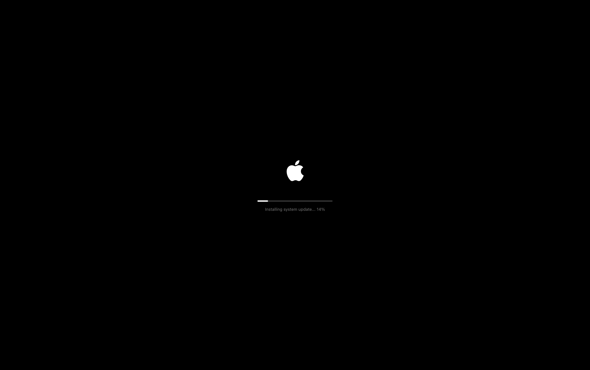
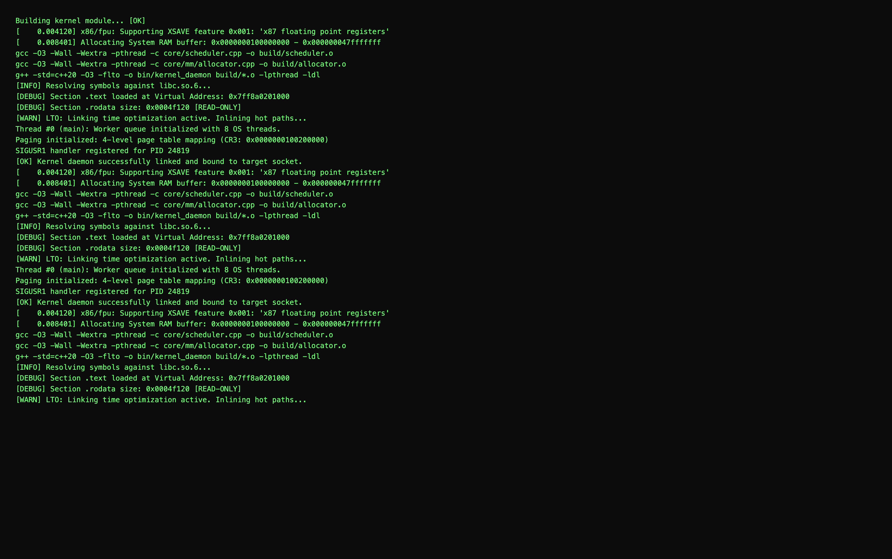
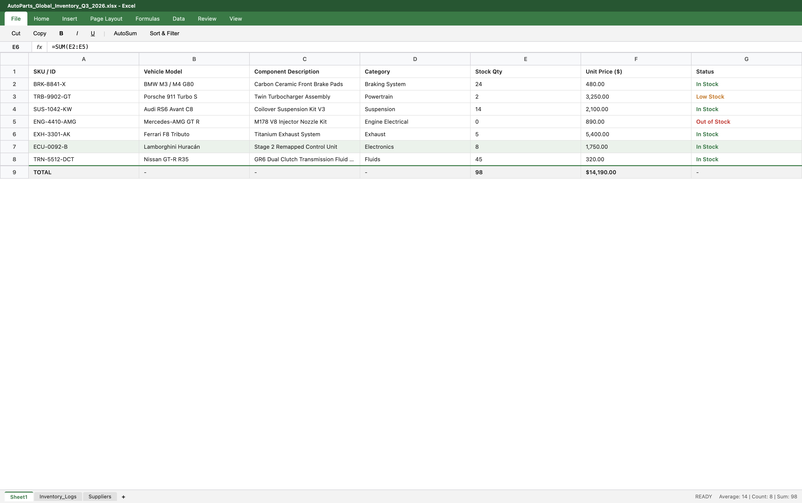

# Panic Screen

An Electron application that instantly toggles your display between a macOS system update screen, a kernel build terminal, and a Microsoft Excel spreadsheet interface. Runs silently in the background and activates via global hotkeys.

## Modes

### 1. macOS System Update (`Key 1`)
Emulates a clean macOS system installation screen with zero OS window borders



### 2. Kernel Terminal Output (`Key 2`)
Simulates C++/Linux kernel compilation output with real-time auto-scrolling



### 3. Microsoft Excel Inventory (`Key 3`)
A full-featured Excel interface featuring ribbon tabs, formula bar, cell coordinates, grid indices, and sheet controls



---

## Hotkeys

| Shortcut / Key | Action |
| :--- | :--- |
| `Cmd + Escape` / `Ctrl + Escape` | Show / Hide Window |
| `1` | Switch to macOS Update |
| `2` | Switch to Terminal Log |
| `3` | Switch to Excel Inventory |
| `Escape` | Close Application |

---

## Installation & Setup

```bash
# Clone the repository
git clone [https://github.com/your-username/panic-screen.git](https://github.com/your-username/panic-screen.git)

# Navigate into directory
cd panic-screen

# Install dependencies
npm install

# Start the application
npm start
